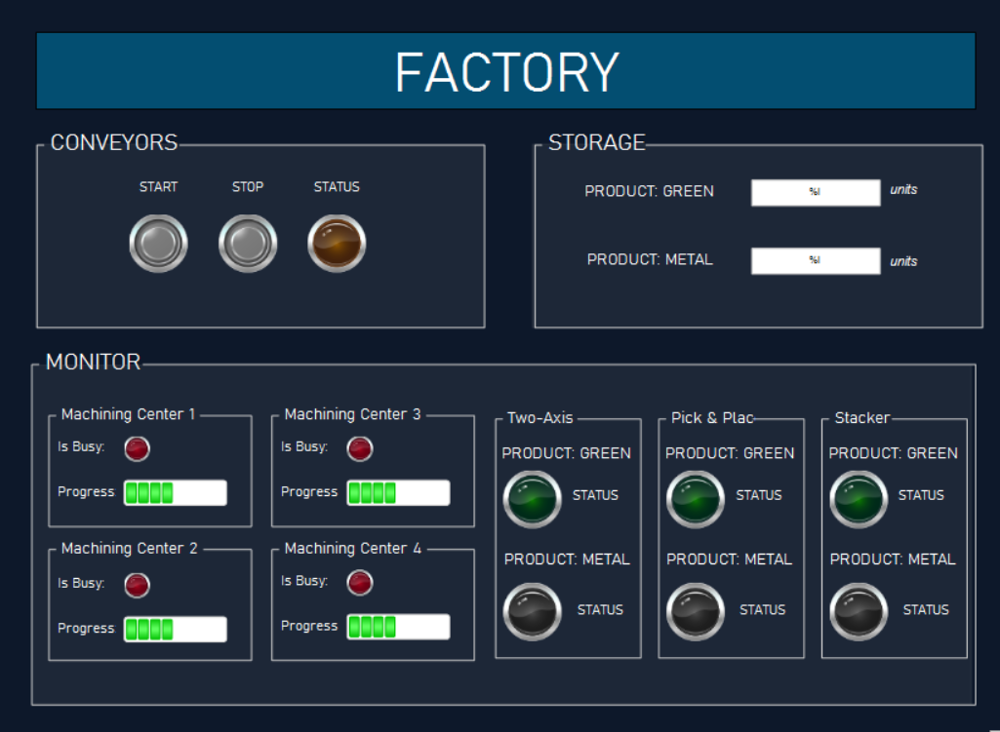

# **Projeto de Automação Industrial - Redes Industriais**  

## **Descrição**  
Este repositório contém o desenvolvimento de um sistema automatizado simulado no **Factory IO** e programado em **Ladder Diagram** no **CODESYS**, como parte da disciplina **Redes Industriais** da **Universidade Federal da Bahia**.  

O projeto representa uma linha de produção automatizada que fabrica dois tipos de materiais (**verde e metálico**) compostos por uma **base** e uma **tampa**. Após a fabricação, o sistema realiza a **embalagem** em uma caixa com **palete** e posterior **armazenamento** e **contagem** do produto.  

Além disso, desenvolvemos uma **Interface Homem-Máquina (IHM)** no CODESYS para monitoramento e controle do sistema.  

## **Demonstração**  
🎥 Assista à simulação da cena no Factory IO: [Link para o vídeo](https://www.youtube.com/watch?v=POr82_qbPrY)

🖼️ Visualização da IHM:

## **Tecnologias Utilizadas**  

### **Factory IO**  
A cena simula uma linha de produção que utiliza os seguintes componentes:  
- **Sensores** (proximidade e visão)  
- **Machine Center**  
- **Pusher**  
- **Conveyor**  
- **Turntable**  
- **Two-Axis**  
- **Pick & Place**  
- **Stacker**  

### **CODESYS**  
A lógica de controle da automação foi desenvolvida em **Ladder Diagram**, utilizando os seguintes recursos:  
- **Diagramas Ladder (LD) puros**  
- **Funções nativas do CODESYS**  
- **Structs**  
- **Function Blocks (FBs)**  
- **Variáveis Globais**  
- **Módulos de Programas**  
- **Interface Homem-Máquina (IHM)**  

## **Estrutura do Repositório**  
📂 **/SceneFactoryIO** → Arquivos da cena simulada no Factory IO  
📂 **/ProjectCODESYS** → Programas e lógica Ladder para controle da automação  
📂 **/images** → Capturas de tela  
📄 **README.md** → Documentação do projeto  

## **Como Executar**  
### **Factory IO**  
1. Abra o Factory IO e carregue a cena do diretório `/SceneFactoryIO`.  
2. Configure a comunicação com o CODESYS.  

### **CODESYS**  
1. Importe os arquivos do diretório `/ProjectCODESYS` para o CODESYS.  
2. Configure a conexão com o Factory IO.  
3. Compile e execute o programa.  
4. Abra a IHM no CODESYS para monitorar o processo.  
